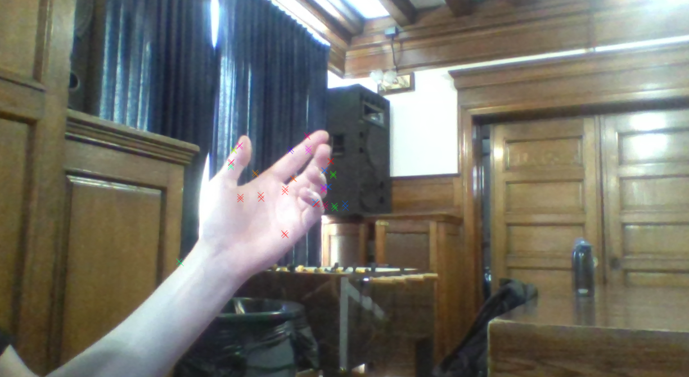
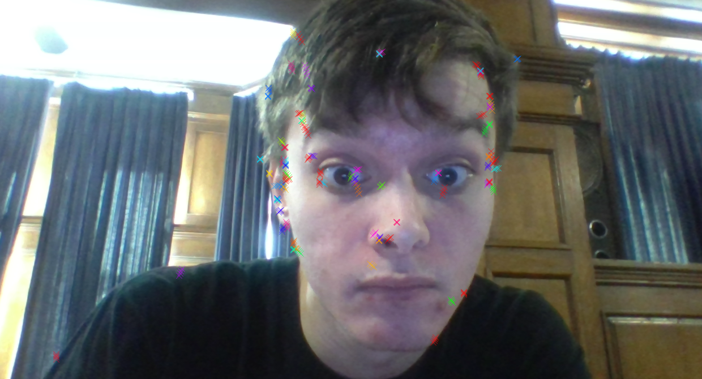

# Chromosome Radiation
* Chromosome Radiation is a way to visualize motion using particles. It works by taking the difference between webcam frames, and at every pixel that changes, there's a certain chance a particle will spawn. A particle in this context is a colored "X" which is generated with a random color, angle, and momentum vector.

# Screenshots

[Video](https://www.instagram.com/p/Bfz5m_qhX0n/)
